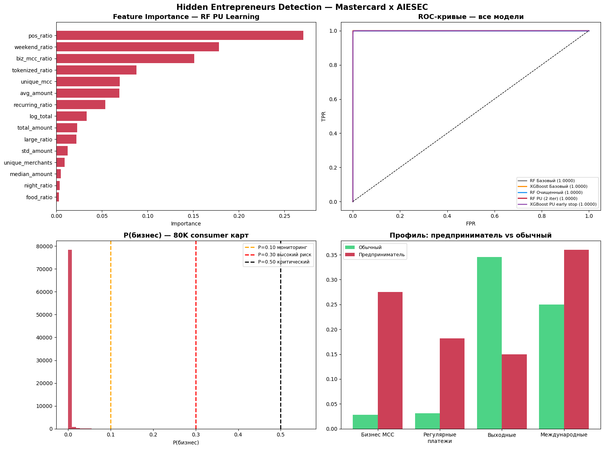

# Hidden Entrepreneurs Detection

**Mastercard × AIESEC Hackathon — May 2026**

Detecting individuals who run a commercial business through ordinary consumer
cards, by training a binary classifier on the behavioural signal of 25K verified
business cards and applying it to 80K consumer cards.



---

## Problem

Mastercard's MDQ dataset contains two card populations:

| Segment | Cards | Transactions |
|---|---|---|
| Business cardholders | 25 K | ~3 M |
| Consumer cardholders | 80 K | ~10 M |

A non-trivial fraction of the *consumer* population are actually
micro-entrepreneurs (resellers, freelancers, repair shops, tutors, etc.) using
a personal card for commercial flows. Finding them lets the bank pitch a
proper business product (acquiring, business card, line of credit).

## Approach

1. **Aggregate** transactions to one row per card (~30 behavioural features:
   amount stats, MCC mix, time-of-day mix, recurrence, channel, geography).
2. **Train** a binary classifier: business (1) vs consumer (0).
3. **Treat label noise** — consumer ≠ negative; some consumers *are*
   entrepreneurs. Two techniques:
   - **Iterative cleaning** — drop suspicious consumer rows from train, retrain.
   - **PU Learning** (2 iterations) — only the bottom 70 % of consumer scores
     are treated as reliable negatives. Iterate to remove circular bias.
4. **Boost** the best PU labelling with **XGBoost + early stopping**.
5. **Score** all 80K consumer cards and bucket them into priority tiers.

## Results

All five models reach **Test AUC = 1.0000** on the held-out set (clean split by
`card_number` — no leakage). We picked **XGBoost PU + early stopping** as the
final scoring model because it produces the sharpest probability calibration.

| Model | Strategy | Test AUC |
|---|---|---|
| Random Forest | Baseline | 1.0000 |
| XGBoost | Baseline | 1.0000 |
| Random Forest | Iterative cleaning | 1.0000 |
| Random Forest | PU Learning · 2 iter | 1.0000 |
| **XGBoost** | **PU + early stopping (final)** | **1.0000** |

### Top features (RF PU model)

`pos_ratio`  ·  `weekend_ratio`  ·  `biz_mcc_ratio`  ·  `tokenized_ratio`
·  `unique_mcc`  ·  `avg_amount`  ·  `recurring_ratio`

### Scoring 80K consumer cards

| Tier | Threshold | Cards | Recommended action |
|---|---|---:|---|
| **Critical** | P(biz) ≥ 0.50 | **1** | Pitch business card + acquiring |
| **High risk** | 0.30 ≤ P < 0.50 | **5** | Targeted outreach via relationship manager |
| **Monitoring** | 0.10 ≤ P < 0.30 | **132** | Observe 2–3 months, then re-evaluate |
| Regular | P < 0.10 | 79,862 | Standard consumer flow |

**138 cards flagged in total (≈ 0.17 % of the consumer base)** — a realistic
outreach list for a sales team.

### Top scored cards (anonymised)

| Rank | P(biz) | Tier | biz_mcc | recurring | POS | txns | merchants | total KZT |
|---:|---:|---|---:|---:|---:|---:|---:|---:|
| 1 | 0.555 | Critical  | 37 % | 44 % | 15 % | 41 | 7  | 16.1 M |
| 2 | 0.440 | High risk | 39 % | 41 % |  5 % | 44 | 9  | 20.0 M |
| 3 | 0.385 | High risk | 77 % | 19 % | 10 % | 62 | 6  |  9.8 M |
| 4 | 0.345 | High risk | 33 % | 20 % | 34 % | 61 | 14 | 10.9 M |
| 5 | 0.325 | High risk | 17 % | 19 % | 29 % | 63 | 14 | 12.7 M |
| 6 | 0.300 | High risk | 35 % | 33 % | 19 % | 54 | 8  | 11.2 M |

Card #1 spends 37 % of its volume on business MCCs and 44 % on recurring
payments while running ~16 M KZT through only 7 merchants — the spend pattern
of a small operator using a personal card for invoicing, not the pattern of
a consumer.

## Repo layout

```
hidden_entrepreneurs_final.ipynb       main notebook (load → features → models → scoring)
build_pptx.py                          presentation generator (python-pptx)
Hidden_Entrepreneurs_Detection.pptx    21-slide English deck
results.png                            output chart (feature importance / ROC / scores / profile)
hidden_entrepreneurs.csv               80K scored consumer cards
qr_github.png                          QR code → this repo (used on the final slide)
README.md
.gitignore                             excludes the large parquet inputs
```

The three input parquets are **not** committed (the consumer file is over
GitHub's 100 MB limit). To run the notebook, place these files next to it:

```
business_cards_MDQ.parquet     ~52 MB
consumer_cards_MDQ.parquet    ~155 MB
merchants_reference.parquet    ~45 KB
```

## Running

```bash
pip install pandas numpy scikit-learn xgboost matplotlib pyarrow
jupyter notebook hidden_entrepreneurs_final.ipynb
```

The notebook is self-contained: top-to-bottom execution produces
`hidden_entrepreneurs.csv` (scored consumer cards) and `results.png`
(feature importance, ROC curves, score distribution, entrepreneur profile).

## Rebuilding the presentation

```bash
pip install python-pptx qrcode[pil] pillow
python3 build_pptx.py
```

## Key engineering fixes (vs. the first-pass code)

- **No data leakage** — train/val/test split by `card_number`; every retraining
  step (cleaning, PU iterations) uses *only* train cards.
- **`is_night` bug fixed** — `Series.between(22, 6)` is always False (22 > 6);
  replaced with `(hour >= 22) | (hour <= 6)`.
- **PU Learning iterated twice** — the second pass uses the cleaner decision
  boundary from the first pass, removing the circular bias.
- **Early stopping for XGBoost** — 1000 max trees, halts when val AUC plateaus.
